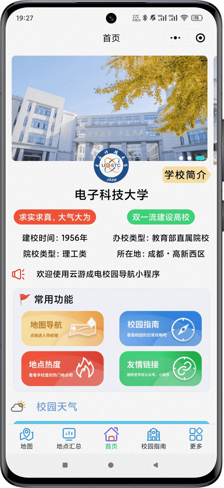
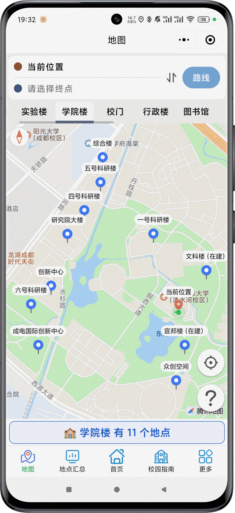
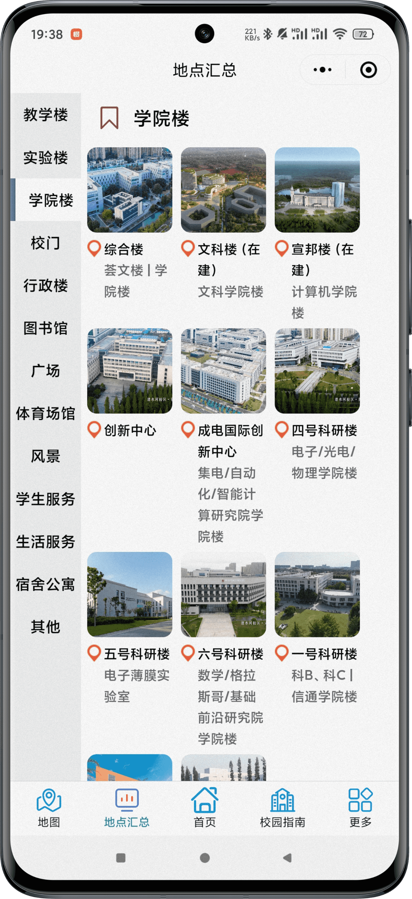
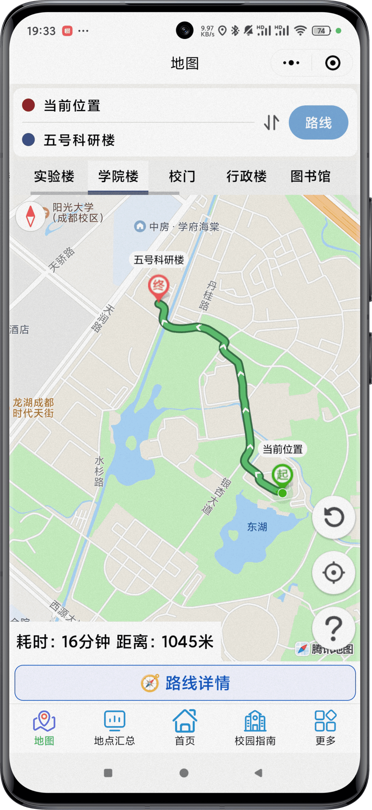
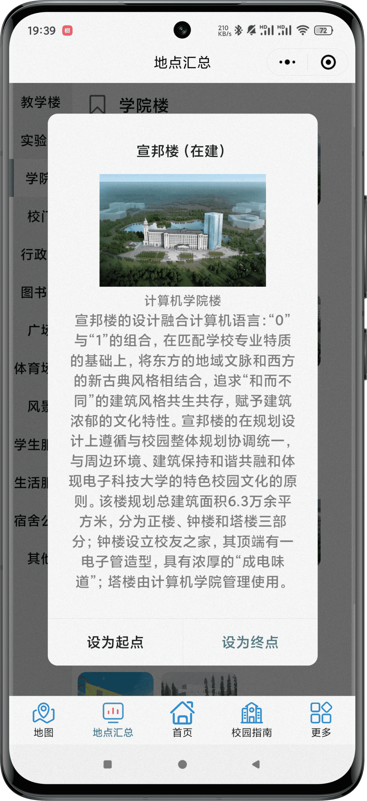
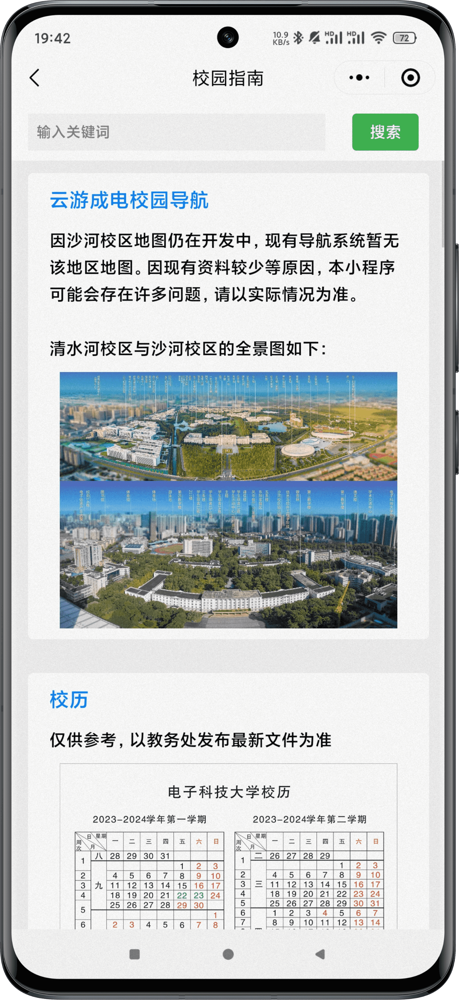

  <h1 align = "center">云游成电校园导航微信小程序</h1>


# 📖 介绍  


校园导航是一款以地图为载体，提供学校**校园地点的位置信息、导航，以及校园信息介绍**的小程序。  

旨在解决传统地图的校园标识不到位、地图形式低效单一、信息设计不够好等问题，为来高校的新生和访客提供更加完美的出行体验。

---
# ⚡️ 功能

☑️地图选点与搜索  ☑️地图路线规划  ☑️校园信息展示  ☑️在线管理数据    ☑️**便于二次开发**  

## 地图相关
- ✅ 校园地点分类动态展示
- ✅ 地点选择与搜索
- ✅ 地点信息展示
- ✅ 路线规划

## 校园相关
- ✅ 校园信息展示
- ✅ 交通信息展示
- ✅ 新生攻略
- ✅ 跳转至学校官微/招生小程序

## 在线管理
- ✅ 管理地点数据（地点类别、地点信息）
- ✅ 地点坐标获取（地图选点）
- ✅ 管理媒体文件（校园地图、封面、轮播图及视频）

   ....................

---
## 🪁目录文件树

```

│-─app.js        //小程序全局入口
│--app.json       //小程序公共配置
│--app.wxss       //小程序公共样式表
│--project.config.json             //项目配置（公共）
│--project.private.config.json    //项目配置（个人）
│--sitemap.json         //微信索引配置
│
├─cloudfunctions           //云函数（需部署）
│  ├─add_category              //添加地点类别
│  │
│  ├─add_site                 //添加地点
│  │
│  ├─browse                  //修改地点浏览量（原子加）
│  │
│  ├─get_openid             //获取用户openid
│  │
│  ├─lianbiao_query            //联表查询
│  │
│  ├─login                  //管理员登录
│  │
│  ├─rank                     //地点热度查询
│  │
│  ├─remove_category          //删除地点类别
│  │
│  ├─remove_site             //删除地点
│  │
│  ├─set_default_site           //设置默认地点
│  │
│  ├─update_category            //更新地点类别信息
│  │
│  ├─update_media             //更新媒体文件
│  │
│  └─update_site            //更新地点信息
│
├─database               //数据库文件（与项目代码无关，需要将图片文件放置在云储存中，
                                    在云数据库中建表并导入数据库文件中的信息）
│  ├─Campus              //校园媒体图片
│  │
│  └─Database              //系统数据库信息（图片url需要根据在云储存中的地址进行替换）
│          admin.json       //管理员信息
│          bus.json            //交通信息（当前项目未使用）
│          category.json        //地点类别
│          media.json            //系统媒体文件
│          site.json            //地点详细信息
│
├─images                     //项目图标等
│
├─libs                         //使用的SDK
│      qqmap-wx-jssdk.min.js          //腾讯位置服务微信小程序SDK
│
├─pages
│  ├─admin              //管理页面（选择地点/媒体管理）
│  │  │
│  │  ├─manage             //地点管理页面（具体）
│  │  │
│  │  ├─manage-category      //类别管理页面（增删改）
│  │  │
│  │  ├─manage-site            //地点管理页面（增删改）
│  │  │  │
│  │  │  └─getpoint             //获取坐标组件
│  │  │
│  │  └─media                //媒体文件管理页面（具体）
│  │
│  ├─home                  //主页
│  │  │
│  │  ├─introduction          //学校简介页
│  │  │
│  │  └─rank                   //地点热度排名页
│  │
│  ├─map                   //地图页
│  │  │ 
│  │  ├─instruction          //使用说明
│  │  │
│  │  └─search                 //地点搜索
│  │
│  ├─more                    //更多功能页
│  │  │
│  │  └─statement            //软件声明
│  │
│  ├─school                  //校园指南页
│  │  │
│  │  └─guidance              //校园指南（具体内容）
│  │
│  └─site                    //地点汇总页
│
└─utils                       //系统文本信息配置
        map.js                 //地图信息
        media.js                 //媒体文件信息（url）
        school.js              //学校信息
        utils.js                //小程序信息
        utils.wxss               //系统整体样式
```

---

# 🤩 项目预览

<center class="half">
    
</center>

<center class="half">
    
</center>

------

# ⚙ 使用说明

### 微信小程序开发准备

```
微信小程序注册，信息填写，微信开发者工具
```

------

### 导入项目

```
将项目导入到微信开发者工具
配置和风天气和腾讯位置服务key以及其配额分配
填写 request合法域名等
```

详细操作可查看[项目导入配置教程](https://blog.csdn.net/weixin_45940369/article/details/130938418)

------

### 微信云开发

```
开通微信云开发
将`/database/Campus`中的文件全部导入云储存
将`/database/Databse`中的数据库信息导入数据库（先建表）
根据云储存中的给出的媒体文件url替换数据库中的媒体文件url
将`/cloudfunctions`中的云函数逐个部署在云开发中的云函数中
```

------

### 修改相应配置文件

```
根据自己的需求对项目的配置进行修改
```

详细操作可查看[项目二次开发教程](https://blog.csdn.net/weixin_45940369/article/details/136439513)

---
# 🧾 参考资料

- [微信官方文档 · 小程序](https://developers.weixin.qq.com/miniprogram/dev/framework/)
- [莞香广科 · 校园导览](https://gitee.com/hm_anwei/school-map)
- [信科校园导览](https://gitee.com/talmudmaster/GIIT-campus-guide)
- [地大校园导航](https://gitee.com/min_yue/CUG_Campus-navigation)
- [西海岸导览](https://gitee.com/tfnmdmx-gitee/xhaGuide)
- [案例分享丨如何设计校园导航系统](https://itc.jnmc.edu.cn/2021/0621/c1949a121868/pagem.htm)
- [桂院校园导航小程序](https://gitee.com/talmudmaster/GLU-Campus-Guide)

---
# 📒 开源许可证

请 **认真阅读并遵守** 开源协议 [Apache-2.0 license](https://github.com/Blizzard-cyber/Campus-Navigation-System?tab=Apache-2.0-1-ov-file#Apache-2.0-1-ov-file)

**禁止用于商业和非法目的**，使用代码 **请标明出处或有所声明**  

---
